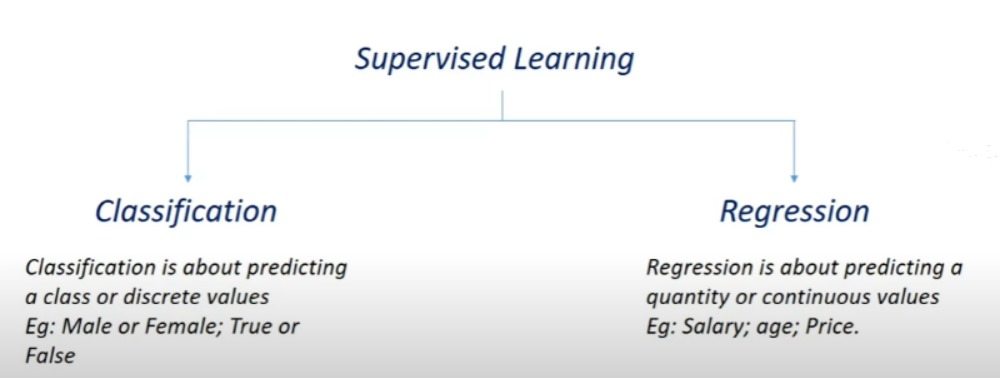

# House-Price-Prediction
Building a House price Prediction System using Machine Learning with Python and XGBoost Regressor.
 
<a href="https://www.kaggle.com/datasets/vikrishnan/boston-house-prices">Dataset</a>
 

 

